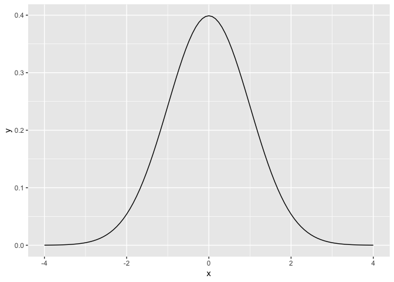

# Overview

The goal of this lab is to carefully, thoroughly, and thoughtfully compare two group means and understand the results. You are also asked to communicate clearly about the steps in your analysis process with others, by sharing your R code, output, and narrative. As such, your code cannot "stand alone"- it is meant to complement / enhance / support your narrative. As with our previous [integrative lab](cm026.html), this lab will be due in two stages:

1. A complete knitted `html` file is due on Sakai by Thursday August 30th at 2:30pm. 
2. After class on August 30th, you'll be provided with a code key. You are asked to review your initial submission, and reflect on your own code/narrative after reviewing the key thoroughly. Your self-assessment is due on Sakai by beginning of class Thursday September 6th (2:30pm). 

Using the key, your self-assessment should include even **more** narrative; where you made mistakes, you must discuss and analyze where you went wrong, and correct them without copying/pasting directly from the key (this typically means that you need to include more narrative than we provide in the key). A good self-assessment will include:

- Assessment of the accuracy and completeness of your "initial solutions"
- Correct worked solutions with some discussion and analysis of why your initial solution was incorrect, and reflection on the source of your confusion (if you got an answer correct, this is not necessary)
- Attributions as appropriate to other students who helped you, or other sources such as lecture notes, readings, online resources, etc. that helped you 

# Headnotes

- This lab is based on the assigned reading that includes [ModernDive Chapter 10.8 on t-tests for comparing two independent samples](http://moderndive.netlify.com/10-hypothesis-testing.html#theory-hypo). Please open and follow closely! 
- Also see [ModernDive Appendix B](http://moderndive.netlify.com/b-appendixb) for examples (search for: `B.5.5 Traditional methods`)
- Parts of this lab are adapted from Ted Laderas' and Jessica Minnier's [R Bootcamp](https://www.datacamp.com/courses/rbootcamp) on DataCamp.com


# Packages

Please install a new version of `infer` first:


```r
remotes::install_github("tidymodels/infer", ref = "develop")
```


```r
library(tidyverse)
library(infer)
library(skimr)
library(broom)
```


# Data


We are going to work with a dataset called `fishermen_mercury.csv`, which consists of factors related to mercury levels among fishermen and a control group of non-fishermen. The data are published within the paper available [online](https://www.sciencedirect.com/science/article/pii/S0269749199002614?via%3Dihub#TBL2). Here is the citation for the peer-reviewed publication:

> N.B. Al-Majed and M.R. Preston (2000). "Factors Influencing the Total Mercury and Methyl Mercury in the Hair of Fishermen in Kuwait," Environmental Pollution, Vol. 109, pp. 239-250.


```r
mercury <- read_csv(here::here("data", "fishermen_mercury.csv"),
                    col_types = cols(
                      fisherman = col_factor(levels = NULL))
                    )
```


Variables in this dataset include:

- Fisherman indicator  (`fisherman`)
- Age in years  (`age`)
- Residence Time in years   (`restime`)
- Height in cm    (`height`)
- Weight in kg    (`weight`)
- Fish meals per week    (`fishmlwk`)
- Parts of fish consumed: 
    - 0=none, 
    - 1=muscle tissue only, 
    - 2=mt and sometimes whole fish, 
    - 3=whole fish  (fishpart)
- Methyl Mercury in mg/g    (`methyl_mercury`)
- Total Mercury in mg/g     (`total_mercury`)

# Motivating research question

Do fishermen have different levels of total mercury than non-fishermen? 

# Exploratory data analysis

Explore the `fisherman` and `total_mercury` variables. Recall that a [new exploratory data analysis](http://moderndive.netlify.com/6-regression.html#model1EDA) involves three things:

* Looking at the raw values.
* Computing summary statistics of the variables of interest.
* Creating informative visualizations.

General functions that we have used at this stage:

- `dplyr::glimpse()`
- `skimr::skim()`
    - Given the two-group design, you may wish to do a `dplyr::group_by()` first here
- `ggplot2::ggplot()`
    - `geom_histogram()` or `geom_density()` or `geom_boxplot()` for numeric continuous variables
        - Given the two-group design, you may wish to combine these with `facet_wrap()`
    - `geom_bar()` or `geom_col()` for categorical variables

You may also find your want to use `filter`, `mutate`, `arrange`, `select`, or `count`. Let your questions lead you! 

# Check conditions

Remember that in order to use the short-cut (formula-based, theoretical) approach, we need to check that some conditions are met. The `infer` package does not automatically check conditions for the theoretical methods to work. In order for the results of the $t$-test to be valid, three conditions must be met:

1. Independent observations in both samples
1. Nearly normal populations OR large sample sizes ($n \ge 30$)
1. Independently selected samples
1. For this lab, we'll also assume that the variance in the response/outcome variable is *the same* for both groups

Write a few sentences to address each of these conditions.

# $t$-test for two independent samples

The following are excerpts from ModernDive:

> "The most common normalization is known as the $z$-score. The formula for a $z$-score is $$Z = \frac{x - \mu}{\sigma},$$ where $x$ represent the value of a variable, $\mu$ represents the mean of the variable, and $\sigma$ represents the standard deviation of the variable.  Thus, if your variable has 10 elements, each one has a corresponding $z$-score that gives how many standard deviations away that value is from its mean.  $z$-scores are normally distributed with mean 0 and standard deviation 1.  They have the common, bell-shaped pattern seen below."

<!-- -->

> "Recall, that we hardly ever know the mean and standard deviation of the population of interest.  This is almost always the case when considering the means of two independent groups.  To help account for us not knowing the population parameter values, we can use the sample statistics instead, but this comes with a bit of a price in terms of complexity."

## Test statistic $\delta$ 

> "Another form of normalization occurs when we need to use the sample standard deviations as estimates for the unknown population standard deviations.  This normalization is often called the $t$-score."  

For the two independent samples case like what we have for comparing fishermen to non-fishermen, the formula is $${\displaystyle T={\frac {({\bar {x}}_{1}-{\bar {x}}_{2})- (\mu_1-\mu_2)}{s_{p}\times {\sqrt {{\frac {1}{n_{1}}}+{\frac {1}{n_{2}}}}}}}}$$
  
where...

- $\bar{x}_1$ is the sample mean response of the first group
- $\bar{x}_2$ is the sample mean response of the second group
- $\mu_1$ is the population mean response of the first group
- $\mu_2$ is the population mean response of the second group
- $s_p$ is the pooled standard deviation of the two samples
- The overall denominator is called the standard error of the difference between means.

From the [Minitab blog](http://blog.minitab.com/blog/adventures-in-statistics-2/understanding-t-tests-t-values-and-t-distributions):

> "A t-value of 0 indicates that the sample results exactly equal the null hypothesis. As the difference between the sample data and the null hypothesis increases, the absolute value of the t-value increases."

Note that the quantity $(\mu_1 - \mu_2)$ is typically 0 under the null hypothesis, so the actual computational formula for the $t$-statistic is:


$${\displaystyle T={\frac {{\bar {x}}_{1}-{\bar {x}}_{2}}{s_{p}\times {\sqrt {{\frac {1}{n_{1}}}+{\frac {1}{n_{2}}}}}}}}$$

where...

$${\displaystyle s_{p}={\sqrt {\frac {\left(n_{1}-1\right)s_{1}^{2}+\left(n_{2}-1\right)s_{2}^{2}}{n_{1}+n_{2}-2}}}}$$

where...

- $s_1$ is the sample standard deviation of the response of the first group
- $s_2$ is the sample standard deviation of the response of the second group
- $n_1$ is the sample size of the first group
- $n_2$ is the sample size of the second group

The $s_p$ here is called the "pooled standard deviation." Now that we have two samples (in our case, fishermen and non-fishermen), we have two standard deviations. Recall that in order to calculate the standard error of one mean we divided the sample standard deviation by the square root of $N$. The pooled standard error is the same idea, but after combining the standard deviations from two samples. The calculation is important, as it assumes that *there is not a difference* in the standard deviations between the two groups, and hence they can be pooled. Remember that $s^2$ is the squared standard deviation, which we know is the variance (i.e., `var(x1)` = `(sd(x1))^2` and `sd(x1)` = `sqrt(var(x1))`). 


Given the above formulas, answer the following questions using R code plus narrative:

* What is the pooled standard error for the `total_mercury` variable? (try to make all quantities here defined variables using `dplyr::group_by() %>% summarize() %>% filter() %>% pull()`)


* What are the minimum $t$-statistic values we need to conclude that there is a significant difference at $\alpha = .05$ (2-tailed)? (hint: degrees of freedom for a two-sample t-test are $N$ - 2)


* Use the following code to plot these critical t-values.


```r
upper_tcrit <- # fill in here
mercury %>% 
  specify(total_mercury ~ fisherman) %>% 
  hypothesize(null = "independence") %>% 
  calculate(stat = "t", order = c(1,0)) %>%
  visualize(method = "theoretical", 
            obs_stat = upper_tcrit, 
            direction = "both") # gives us shading
```


* Now we know the minimum $t$-statistic value we need to beat, what is the minimum absolute value for the mean difference we need to detect significance with $\alpha = .05$ (2-tailed)? (big hint: realize that the rearranged formula below may be helpful!)

$${\displaystyle T \times {s_{p}\times {\sqrt {{\frac {1}{n_{1}}}+{\frac {1}{n_{2}}}}}}}={{\bar {x}}_{1}-{\bar {x}}_{2}}$$


* Complete this sentence filling in numbers from your above calculations:

> With $n_1$ fisherman and $n_2$ non-fishermen, given the variability in total mercury present in this sample, we will reject the null hypothesis that there is no difference in total mercury levels between the two groups if we obtain a $t$-statistic greater than X (absolute value, $\alpha$ = .05, 2-tailed). This is equivalent to saying we will reject the null hypothesis if we obtain a mean difference greater than X (absolute value, $\alpha$ = .05, 2-tailed).


 

## Observed effect $\delta^*$

Answer the following questions using R code and narrative:

* What mean difference (raw) did we observe? Is it greater than the minimum mean difference we need to beat? (hint: try `infer::specify` then `calculate` with `stat = "diff in means"`). 


* Calculate the $t$-statistic "by hand" using R. Is it greater than the minimum $t$-statistic we need to beat? (here is the formula again):

$${\displaystyle T={\frac {{\bar {x}}_{1}-{\bar {x}}_{2}}{s_{p}\times {\sqrt {{\frac {1}{n_{1}}}+{\frac {1}{n_{2}}}}}}}}$$


* Do a classical 2-sample t-test (assuming equal variances, more on this later) in R using `infer`, do the results match your calculations?:


```r
mercury %>% 
  t_test(total_mercury ~ fisherman, order = c(1, 0), var.equal = TRUE)
```


* Interpret this output. What is the statistic? What is the meaning/interpretation of the confidence interval here? (hint: Does it include zero? What does it mean if it does or does not? What value is in the center of the interval?)


* Use the code below to compare the normal distribution to the $t$-distribution, which has only one parameter: degrees of freedom (`df`). You can use the `dt` and `dnorm` with the `stat_function` layer in `ggplot` to plot the *densities* for each distribution. Change the `df` argument here a few times to view its effect: what do you see? (you don't need to print any of these plots to your final file- I want you to reflect on how the two distributions differ). 


```r
df <- 10
ggplot(data.frame(x = c(-4, 4)), aes(x)) + 
  stat_function(fun = dt, args = list(df = df)) + # t dist
  stat_function(fun = dnorm, lty = 3, color = "red") # normal dist in red
```


* Save your observed $t$-statistic, and use `infer` to make a plot of the null t-distribution with a red line for your `obs_stat`, shading in both directions. Try adding `geom_vline()` to this object so you can add vertical lines where your two "critical t-values" are. 


## The theoretical p-value

But, how can we calculate the p-value from this? Well the easy way is with your `infer` output :) But! Remember that your observed $t$-statistic is a *quantile* value for a statistic that we *assume* follows a $t$-distribution. How do we calculate the probability of getting a $t$-statistic as or more extreme than the one we got? We use `pt()`!

* Use `pt()` to calculate the 2-sided p-value in R. Does it match the output from `infer`?


## The theoretical confidence interval 

Unfortunately, we currently can't get the confidence interval for theoretical methods using `infer`. But we can use formulas (yay): 

$$ ({\bar {x}}_{1}-{\bar {x}}_{2}) \pm (t_{\star} \times SE_{{\bar {x}}_{1}-{\bar {x}}_{2}})$$
where...

$$SE_{{\bar {x}}_{1}-{\bar {x}}_{2}} = s_{p}\times {\sqrt {{\frac {1}{n_{1}}}+{\frac {1}{n_{2}}}}}$$ 
You should already have variables for the mean difference and the $t$-statistic critical value(s) (here, $t_{\star}$) from the top formula. In the bottom formula, that standard error should look familiar- it is the standard error of the difference between means. This was the denominator in your calculated $t$-statistic. 

* Use these values to calculate the 95% confidence interval for the difference in means. Does it match the output from `infer`? Does it contain zero? Will this interval ever *not* contain the observed difference in sample means?


# Compare t-test results to permutation test

Using [ModernDive 10.7](http://moderndive.netlify.com/10-hypothesis-testing.html#example-comparing-two-means) as an example, as well as our previous [resampling lab](https://apreshill.github.io/ohsu-basic-stats/cm034.html), conduct a permutation test to evaluate whether there is a mean difference in total mercury between fishermen and non-fishermen. What do you conclude, and how do these results compare to those based on the classical hypothesis test? What, if any, assumptions of each method are comfortable or uncomfortable with?

# Compare t-test results to linear regression

Use a simple linear regression to analyze `total_mercury ~ fisherman`. Look carefully at the output, and compare to the output of the classical t-test. What do you notice is the same?


