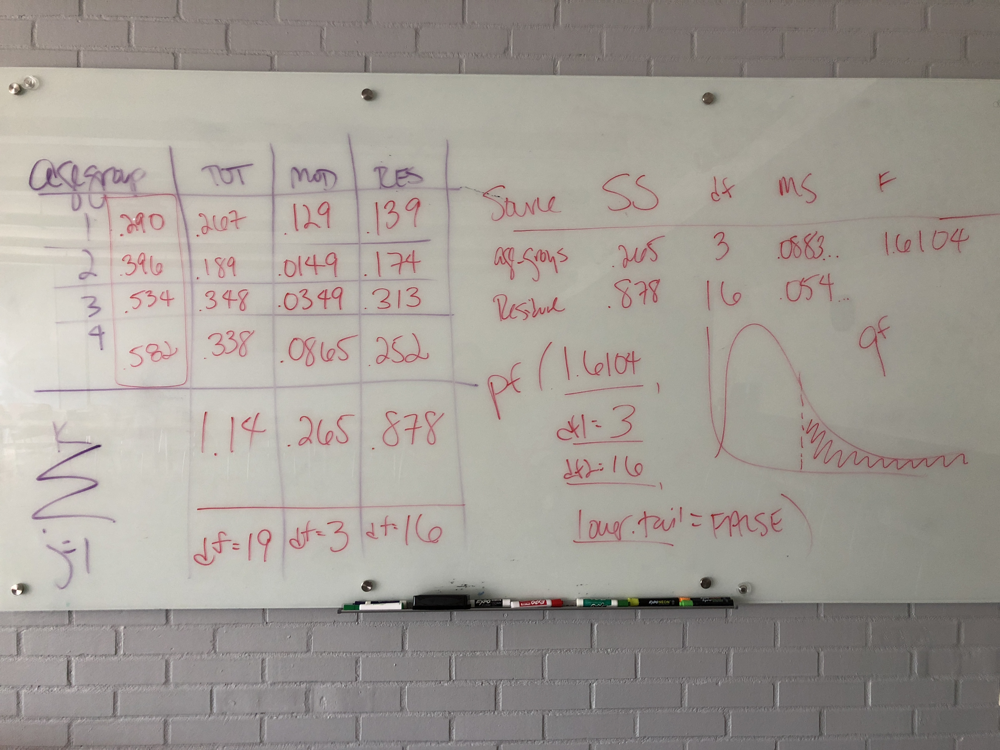

```{r include = FALSE}
knitr::opts_chunk$set(error = TRUE, comment = NA, warning = FALSE, message = FALSE, tidy = FALSE)
options(scipen = 999)
library(tidyverse)
theme_set(theme_minimal())
library(DT)
```


# Logistics

* A complete knitted `html` file is due on Sakai by Tuesday September 11 (2:30pm). 
* This lab is based on the assigned reading that includes [this article on ANOVA in Nature Points of Significance](https://www.nature.com/articles/nmeth.3005). 
* Also, this [blog post](http://blog.minitab.com/blog/adventures-in-statistics-2/understanding-analysis-of-variance-anova-and-the-f-test) is very well-written and helpful.

# Overview

In the last [lab](cm043.html), we did an ANOVA by hand, then you did a linear regression using `lm` and (hopefully) saw that a one-way ANOVA and a simple linear regression *are equivalent*. Both are based on the general linear model, and rely on calculating statistics based on sums of squares. 



In this lab, we'll start with post-hoc tests and p-value corrections, leading up to a two-way ANOVA where we include *two* predictor or independent variables. Get excited!

# Packages

```{r load_packages}
library(tidyverse)
library(janitor)
library(moderndive)
library(broom)
library(multcomp)
select <- dplyr::select # deals with the namespace conflict
```

# Get the data

This is all the same as in the previous [lab](cm043.html).

> "A univariate [read: one response/outcome variable] ANOVA was conducted investigating the impact of the between-subjects factors [read: all levels of factors are measured from independent samples] of age (4: 3–4 years, 5–6 years, 7–8 years, 9–11 years), number of resources (2: 12 or 30 stickers), number of recipients (2: 1 or 2 anonymous recipients), and gender (2: female, male) on the proportion of resources shared."

```{r}
# create variable to store url
link <- "https://dataverse.harvard.edu/api/access/datafile/2712105"

# read in column names only
sticker_names <- link %>% 
  read_tsv(n_max = 0) %>% # default: col_names = TRUE
  rename(stickersgiven = 'absolutenumberofstickersgiven(Conditions1or3:Outof12;Conditions2or4:Outof30)') %>% 
  names()

# read in data, set column names
stickers <- link %>% 
  read_tsv(skip = 2, col_names = sticker_names) %>% 
  clean_names()

# clean it up a bit
# in class we got errors, so we commented out two lines
stickers_clean <- stickers %>% 
  mutate(num_stickers = case_when(
    number_stickers == 1 ~ 12,
    number_stickers == 2 ~ 30)) %>% 
  filter(!(subject_number == 263)) %>% 
  filter(gender %in% c(1, 2)) %>% 
  #mutate(condition = if_else(subject_number == 263, 3L, condition)) %>% 
  #mutate(num_stickers = if_else(subject_number == 263, 30L, num_stickers)) %>% 
  mutate(prop_given = round(stickersgiven / num_stickers, 2)) %>% 
  select(-percent_given_outof100percent, -number_stickers) %>% 
  mutate(giveornot = case_when(
    prop_given == 0 ~ 0,
    prop_given > 0 ~ 1)) 

givers <- stickers_clean %>% 
  filter(giveornot == 1) %>% 
  mutate(age_groups = as.factor(agegroups),
         gender = as.factor(gender))
```


# Plot the group means

Use `ggplot2` to make a plot that allows you to visualize the mean proportion of stickers given by age group for the givers, and allows you to see the spread as well. Think about whether you can also include the actual observed data points as recommended by [Tracy Weissberger](https://journals.plos.org/plosbiology/article?id=10.1371/journal.pbio.1002128). 

```{r echo = FALSE}
ggplot(givers, aes(x = age_groups, y = prop_given, 
                   fill = age_groups, colour = age_groups)) + 
  geom_dotplot(stackdir = "center", binaxis = "y", 
    binwidth = .01, binpositions = "all", stackratio = .8, dotsize = 2, alpha = .5) + 
  stat_summary(fun.y = mean, fun.ymin = mean, 
    fun.ymax = mean, geom = "crossbar", width = 0.75, lwd = .75) + 
  scale_x_discrete(name = "age group") + 
  scale_y_continuous(name = "proportion of stickers given") +
  geom_hline(aes(yintercept = mean(prop_given)), lty = "dashed") +
  theme(legend.position = "none") 
```

```{r echo = FALSE}
library(ggbeeswarm)
ggplot(givers, aes(x = age_groups, y = prop_given, 
                   fill = age_groups, colour = age_groups)) + 
  geom_beeswarm(alpha = .5) +
  geom_boxplot(fill = NA) +
  scale_x_discrete(name = "age group") + 
  scale_y_continuous(name = "proportion of stickers given") +
  geom_hline(aes(yintercept = mean(prop_given)), lty = "dashed") +
  theme(legend.position = "none") 
```


Also make a plot of the means with standard error bars colored by gender, following help [here](http://www.cookbook-r.com/Graphs/Plotting_means_and_error_bars_(ggplot2)/) (no bar graphs/dynamite plots)!

Also see this [link](https://apreshill.github.io/data-vis-labs-2018/04-distributions.html#14_plotting_summary_statistics).

```{r echo = FALSE}
ggplot(givers, aes(x = age_groups, y = prop_given, colour = gender)) +
  stat_summary(fun.y = mean, geom = "point") + 
  stat_summary(fun.y = mean, geom = "line", aes(group = gender)) +
  stat_summary(fun.data = mean_cl_boot, geom = "errorbar", width = 0.2) + 
  labs(x = "age_group", 
       y = "proportion of stickers given",
       colour = "gender") +
  coord_cartesian(ylim = c(0, 1))
```


# Post-hoc testing

If you feel happy to assume that the variances of the response/outcome/dependent variable are equal across groups, you can use a method for comparing the individual groups called Tukey's Honestly Significant Difference. The way to do this contrast procedure is to use a package called `multcomp`. Let's start with the `lm` object.

```{r}
sticker_lm <- lm(prop_given ~ age_groups, data = givers)
anova(sticker_lm)
sticker_mcp <- glht(sticker_lm, mcp(age_groups = "Tukey"))
confint(sticker_mcp)
summary(sticker_mcp, test = univariate()) #unadjusted p values
```

You can also plot these with base R.

```{r}
plot(sticker_mcp)
```

For which age groups is the difference in mean `prop_given` significantly different from zero?

Alternatively, you can do post-hoc pairwise t-tests. These are not the same as normal t-tests!

$$t = \frac{\bar{x}_i - \bar{x}_j}{\sqrt{MS_{residual} (\frac{1}{n_i} + \frac{1}{n_j})}}$$

```{r}
with(givers, pairwise.t.test(prop_given, age_groups,
                             paired = FALSE))
```

# Adjust p-values


```{r}
summary(sticker_mcp, test = adjusted("bonferroni")) #p value adjustment
```

