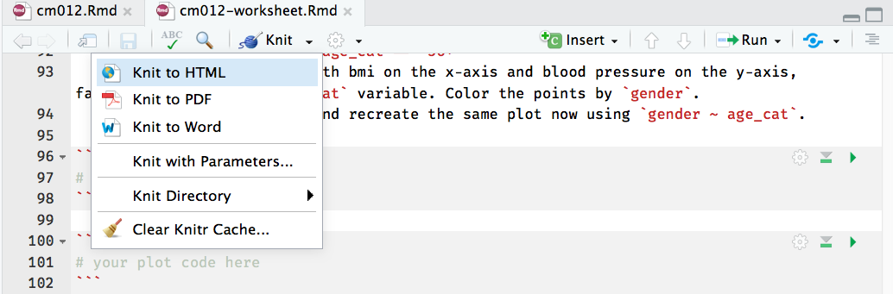

```{r setup, include=FALSE}
# leave this chunk alone
options(knitr.table.format = "html") 
knitr::opts_chunk$set(warning = FALSE, message = FALSE, 
  comment = NA, dpi = 300)
```

## Download this worksheet

<a href="https://apreshill.github.io/ohsu-basic-stats/labs/cm012-worksheet.Rmd">Worksheet</a>

## Notepad

http://bit.ly/conj620-cm012


## Set-up

- Load the `tidyverse` package (must be installed first! *Do not* install packages within your scripts)
- Using `readr` package, we import our csv with `read_csv` function
- The first argument in the `read_csv()` parentheses is the url to the dataset
- The second argument, `na = "."`, specifies that missing data in this dataset is denoted by a period
- Finally, we assign the data to an R object using `<-` and call that object `heart`

```{r}
library(tidyverse)
heart <- read_csv("http://faculty.washington.edu/kenrice/heartgraphs/nhanesmedium.csv", 
                  na = ".") 
```

## Data Dictionary

From the [data dictionary](http://faculty.washington.edu/kenrice/heartgraphs/):

* `BPXSAR`: systolic blood pressure (mmHg)
* `BPXDAR`: diastolic blood pressure (mmHg)
* `BPXDI1`, `BPXDI2`: two diastolic blood pressure readings
* `race_ethc`: race/ethnicity, coded as:
    - Hispanic, 
    - White non-Hispanic, 
    - Black non-Hispanic and 
    - Other
* `gender`: sex, coded as Male/Female
* `DR1TFOLA`: folate intake (μg/day)
* `RIAGENDR`: sex, coded as 1/2
* `BMXBMI`: body mass index (kg/m2)
* `RIDAGEY`: age (years)

## 1. How many rows and columns are in the `heart` data?

```{r}
# your code here
```


## 2. Use `dplyr` to answer these questions:
  - What is the minimum age in years?
  - What is the maximum age in years?
    
```{r}
# your code here
```

*If this was easy: there are actually (at least) 4 ways to do this with `dplyr` functions. Try to figure out four ways to do this!*

## 3. Use `dplyr` to do the following:
  - Make a new variable in `heart` called `RIDAGEMOS` that converts `RIDAGEYR` to months.
  - For individuals 960 months or older, what is the range of BMI values?
  - For individuals exactly 96 months of age, what is the range of BMI values?
    
```{r}
# your code here
```

## 4. Use `ggplot2` to make a scatterplot with age in years on the x-axis and systolic blood pressure on the y-axis.


```{r}
# your code here
```

*If this was easy: import the larger dataset (http://faculty.washington.edu/kenrice/heartgraphs/nhaneslarge.csv) and make a hexagonal heatmap of 2d bin counts. Apply a custom continuous color palette to the hexbins, and reverse the colors such that lighter colors are for lower counts and darker colors are for higher counts.*

## 5. Use `dplyr` and `ggplot2` to do the following:
  - Type `?case_when` to read the help documents for this `dplyr` function. Look carefully at the examples (*hint:* you might find the `star_wars` example most helpful- you can run that code in your console!). Use this function to make a new variable called `age_cat` with 3 values:
      - `between(<name_of_age_var>, 0, 30)` is `age_cat == "Under 30"`
      - `between(<name_of_age_var>, 31, 55)` is `age_cat == "31-55"`
      - all other ages are `age_cat == "56+"`
  - Create a scatter plot with bmi on the x-axis and blood pressure on the y-axis, facetting by your new `age_cat` variable. Color the points by `gender`.
  - Look up `?facet_grid`, and recreate the same plot now using `gender ~ age_cat`.
    
```{r}
# your case_when code here
```

```{r}
# your plot code here
```

*If this was easy, add linear regression lines to all six facetted grids (keep the standard error ribbons). Apply a custom color palette and remove the color legend guide. Play with `alpha` levels for the points. Use something other than the default `theme_gray()`.*

## 6. Knit to html

*very important*: delete the text below in order to be able to knit (you won't have the image file in your directory)




