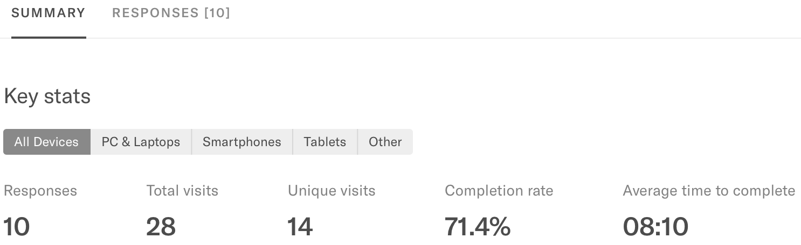
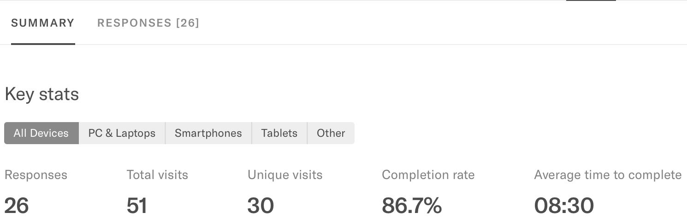

```{r setup, include=FALSE}
options(htmltools.dir.version = FALSE)
options(knitr.table.format = "html") 
knitr::opts_chunk$set(warning = FALSE, message = FALSE, 
  comment = NA, dpi = 300,
  fig.align = "center", out.width = "65%", cache = FALSE)
library(tidyverse)
library(babynames)
```

## Hi & welcome!


---
## Where are we going?


---
## Learning outcomes

-	Develop and clearly describe a statistical analysis plan, from start to finish.

--

-	Work independently with data, including wrangling, tidying, visualizing, and basic analyses.

--

-	Accurately interpret results from basic inferential statistical analyses.

--

-	Understand assumptions and limitations to statistical procedures.

--

-	Know about the types/scope of questions one can ask about data.

--

-	Identify statistical questions/problems that require advanced methods out of skill set.

--

-	Proficient use of tools and vocabulary to facilitate effective collaboration with advisors, biostatisticians, and other team members.

---
## How will we get there?

- ModernDive
- R4DS
- DataCamp.com
- Blogs, YouTube, PEERJ, Nature, etc.


---
class: inverse, middle, center
## Safe-stats


> *"Statisticians have a tendency to advocate statistical abstinence: you should only practice statistics if you’re in a long-term relationship with a statistician (Wickham 2015). But abstinence-based education rarely works. People see their friends using statistics and having a great time, and there simply aren’t enough statisticians to go around. As a field, we need to teach safe-stats, not just statistical abstinence."* 

--

Jenny Bryan & Hadley Wickham

https://arxiv.org/pdf/1712.07349.pdf

https://nhorton.people.amherst.edu/mererenovation/17_Wickham.PDF

---
class:inverse, middle, center
## My 30-minute rule


---
## Your articles

- Find a partner
- Share with each other terms from each of your articles that:
    - you didn’t know,
    - you have heard before but can’t define or explain to other people, or
    - you can’t actually do (i.e., if you had their data, could you replicate?)
- Use this link to add terms
    - http://bit.ly/conj620-cm011

---
class:inverse, middle, center
## On seriousness


---
class:inverse, middle, center

## Our get-to-know-you survey results are in...

---
```{r echo = TRUE, results = 'hide'}
library(tidyverse)
library(janitor)
library(here)

hi <- read_csv(here::here("data", "conj620-hi-20180623.csv")) %>%
  clean_names() %>% 
  rename("id" = 1, "name" = 2, "email" = 3, "year" = 4, 
         "age_guess" = 5, "program" = 6, "link" = 22, 
         "goals" = 23, "excited" = 24, "stats" = 25) %>% 
  filter(!name == "Jackie") %>% 
  select(year:program, 
         heard_of_ = other:none_of_these, 
         used_for_stats = excel:other_1, 
         goals:stats, submit_date_utc) %>% 
  mutate(program = word(program, start = -1),
         program = str_remove(program, "\\("),
         program = str_remove(program, "\\)"),
         id = row_number(),
         age_guess = parse_number(age_guess),
         heard_of_5 = if_else(!is.na(heard_of_5), 
                              "Git", 
                              heard_of_5)) %>% 
  mutate(early = case_when(
    submit_date_utc < "2018-06-24" ~ "early",
    TRUE ~ "later"
  ))
```

---

```{r}
hi
```

---

```{r}
glimpse(hi)
```

---
## But I did all that on Saturday, when...



---
## Now...

--




---

```{r echo = TRUE, results = 'hide'}
library(tidyverse)
library(janitor)
library(here)

hi <- read_csv(here::here("data", "conj620-hi-20180626.csv")) %>% #<<
  clean_names() %>% 
  rename("id" = 1, "name" = 2, "email" = 3, "year" = 4, 
         "age_guess" = 5, "program" = 6, "link" = 22, 
         "goals" = 23, "excited" = 24, "stats" = 25) %>% 
  filter(!name == "Jackie") %>% 
  select(year:program, 
         heard_of_ = other:none_of_these, 
         used_for_stats = excel:other_1, 
         goals:stats, submit_date_utc) %>% 
  mutate(program = word(program, start = -1),
         program = str_remove(program, "\\("),
         program = str_remove(program, "\\)"),
         id = row_number(),
         age_guess = parse_number(age_guess),
         heard_of_5 = if_else(!is.na(heard_of_5), "Git", 
                              heard_of_5)) %>% 
  mutate(early = case_when(
    submit_date_utc < "2018-06-24" ~ "early",
    TRUE ~ "later"
  ))
```

---
class:inverse, middle, center

## Who are you?

---

```{r}
ggplot(hi, aes(x = year)) + 
  geom_bar(fill = "mediumseagreen", alpha = .6)
```

---
```{r}
ggplot(hi, aes(x = fct_infreq(program))) + 
  geom_bar(fill = "mediumseagreen", alpha = .6) + 
  coord_flip() + 
  labs(x = "program")
```


---
class:middle, inverse, center

## Where are you starting from?

---

```{r}
heard_of <- hi %>% 
  select(id, starts_with("heard_of")) %>% 
  gather(option, heard_of, starts_with("heard_of"), na.rm = TRUE) 

heard_of
```

---
## Counting what you have heard of 

```{r}
heard_of %>% 
  count(heard_of, sort = TRUE) %>% 
  knitr::kable()
```

---
## Counting what you have heard of 

```{r}
heard_of %>% 
  count(id, heard_of) %>% 
  filter(!heard_of == "None of these") %>% 
  count(id, sort = TRUE) %>% 
  rename("num_heard_of" = nn) %>% 
  knitr::kable()
```

---
## Counting what you have heard of 

```{r}
heard_of %>% 
  filter(!heard_of == "None of these") %>%  
  count(id, heard_of) %>% 
  count(id) %>%
  complete(id = full_seq(id, period = 1), fill = list(nn = 0)) %>% 
  count(nn) %>% 
  select("people" = n, "heard_of" = nn) %>% 
  arrange(desc(heard_of)) %>% 
  knitr::kable()
```


---

```{r}
ggplot(heard_of, aes(x = fct_relevel(heard_of, "None of these"))) + 
  geom_bar(fill = "mediumseagreen", alpha = .6) +
  coord_flip() +
  labs(x = "heard_of")
```

---

```{r}
used <- hi %>% 
  select(id, starts_with("used_for_stats")) %>% 
  gather(option, used_for_stats, starts_with("used_for_stats"), na.rm = TRUE) 

used
```

---

```{r}
ggplot(used, aes(x = fct_infreq(used_for_stats))) + 
  geom_bar(fill = "mediumseagreen", alpha = .6) +
  coord_flip() +
  labs(x = "used_for_stats")
```

---
class:middle, inverse, center

## Watch Mona Chalabi video

```{r echo = FALSE, out.width='100%'}
knitr::include_url("https://www.youtube.com/embed/Zwwanld4T1w")
```


---
class:middle, inverse, center
## Guessing my age


---

```{r}
ggplot(hi, aes(x = age_guess)) +
  geom_histogram(fill = "mediumseagreen", color = "white",
                 alpha = .6, binwidth = 2)
```

---
```{r}
ggplot(hi, aes(x = age_guess)) +
  geom_density(fill = "mediumseagreen", alpha = .6, color = NA)
```

---

```{r}
ggplot(hi, aes(x = age_guess)) +
  geom_dotplot(fill = "mediumseagreen", alpha = .6, 
               method = 'histodot', binwidth = 2)
```

---

```{r echo = FALSE, out.width='50%'}
ggplot(hi, aes(x = age_guess)) +
  geom_density(fill = "mediumseagreen", alpha = .6, color = NA) +
  geom_vline(aes(xintercept = mean(age_guess)), 
             color = "dodgerblue", lty = 3) +
  geom_vline(aes(xintercept = median(age_guess)), 
             color = "firebrick1", lty = 5) +
  geom_vline(xintercept = 37, 
             color = "black") +
  annotate("text", label = "mean", x = mean(hi$age_guess) - 1.2, 
           y = .1, color = "dodgerblue") +
  annotate("text", label = "median", x = median(hi$age_guess) - 1, 
           y = .08, color = "firebrick1") +
  annotate("text", label = "truth!", x = 37 + 1, 
           y = .07, color = "black")
```

```{r}
hi %>% 
  select(age_guess) %>% 
  summarize_all(funs(min, max, median, mean, sd), na.rm = TRUE) %>% 
  knitr::kable()
```

---
```{r echo = FALSE}
ggplot(hi, aes(x = age_guess)) +
  geom_rect(aes(xmin = min(age_guess), xmax = 35, ymin = 0, ymax = .125), 
            fill = "lightcoral", alpha = .01) +
  annotate("text", label = "A+", x = 28, 
           y = .06, color = "lightcoral") +
  geom_rect(aes(xmin = 38, xmax = max(age_guess), ymin = 0, ymax = .125), 
            fill = "black", alpha = .01) +
  geom_density(fill = "mediumseagreen", alpha = .8, color = NA) 
```

---
class:middle, inverse, center

## How excited are you??


---

```{r}
ggplot(hi, aes(x = excited)) + 
  geom_bar(fill = "mediumseagreen", alpha = .6)
```

---

```{r}
ggplot(hi, aes(x = submit_date_utc, y = excited)) + 
  geom_point(color = "mediumseagreen") + 
  geom_hline(aes(yintercept = mean(excited))) + 
  scale_x_datetime(date_labels = "%A", date_breaks = "1 day")
```

---

```{r out.width = '60%'}
ggplot(hi, aes(x = submit_date_utc, y = excited)) + 
  geom_segment(aes(xend = submit_date_utc, yend = mean(excited)),
               color = "mediumseagreen") +
  geom_point(color = "mediumseagreen") + 
  geom_hline(aes(yintercept = mean(excited))) + 
  scale_x_datetime(date_labels = "%A", date_breaks = "1 day")
```

---
class:middle, inverse, center

## Is there a difference in mean excitement levels based on when you responded to my survey?

`early` ~ Responded on Saturday

`later` ~ Responded Sunday or later

---
```{r out.width='50%'}
ggplot(hi, aes(x = early, y = excited, fill = early)) +
  geom_boxplot(alpha = .6) +
  scale_fill_manual(values = c("mediumseagreen", "dodgerblue"), 
                    guide = FALSE) +
  theme_minimal() +
  labs(x = "")
```

---
```{r out.width='50%'}
ggplot(hi, aes(x = early, y = excited, fill = early)) +
  geom_boxplot(alpha = .6, outlier.color = NA, colour = "gray50") +
  geom_jitter(width = .2, alpha = .5, height = .05) +
  scale_fill_manual(values = c("mediumseagreen", "dodgerblue"), 
                    guide = FALSE) +
  theme_minimal() +
  labs(x = "")
```

---
```{r out.width='60%'}
ggplot(hi, aes(x = excited, fill = early)) +
  geom_density(alpha = .6) +
  scale_fill_manual(values = c("mediumseagreen", "dodgerblue"),
                    name = "") +
  theme_minimal() +
  labs(x = "")
```


---
```{r}
ggplot(hi, aes(x = age_guess, y = excited)) +
  geom_point()
```

---
```{r}
ggplot(hi, aes(x = age_guess, y = excited)) +
  geom_point() +
  geom_smooth(method = "lm")
```

---
class:middle, inverse, center
## Discuss with your partner

.pull-left[
```{r echo = FALSE}
ggplot(hi, aes(x = age_guess, y = excited)) +
  geom_point()
```
]

.pull-right[
```{r echo = FALSE}
ggplot(hi, aes(x = age_guess, y = excited)) +
  geom_point() +
  geom_smooth(method = "lm")
```
]

## What's wrong on the right?

(the data is the *exact* same)