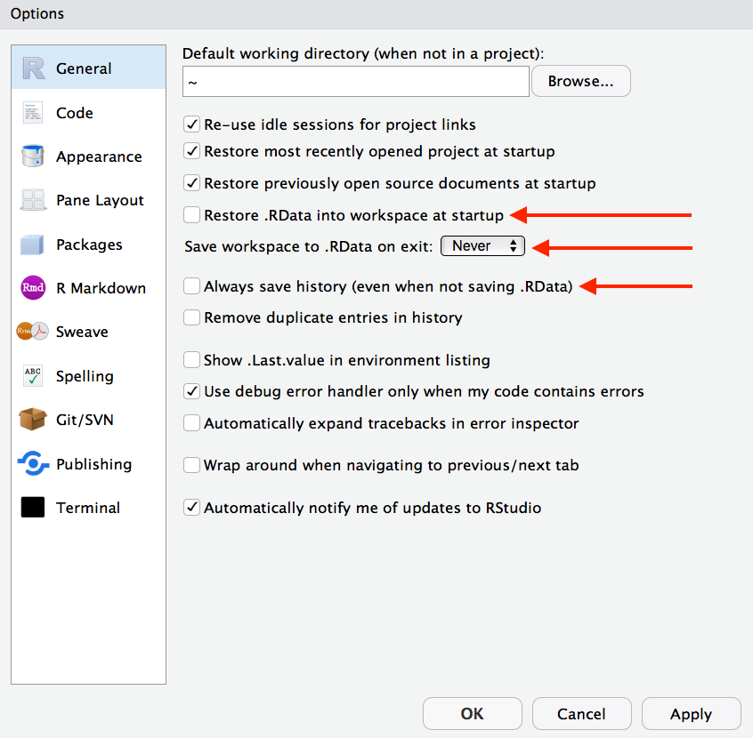

```{r setup, include=FALSE}
options(htmltools.dir.version = FALSE)
options(knitr.table.format = "html") 
knitr::opts_chunk$set(warning = FALSE, message = FALSE, 
  comment = NA, dpi = 300,
  fig.align = "center", out.width = "65%", cache = FALSE,
  error = FALSE)
library(tidyverse)
```

## Objects and functions

> "To understand computations in R, two slogans are helpful:
- Everything that exists is an object, and 
- Everything that happens is a function call."


John Chambers, quoted in Advanced R, p. 79.
---
class: middle, inverse

## To make your `mutate` "stick"

```{r eval = FALSE}
heart_bp <- heart_bp %>% 
  mutate(bp_ratio = BPXDI1 / BPXDI2)
```

[From CM 1.2, slide #39](https://apreshill.github.io/ohsu-basic-stats/slides/cm012.html#39)

---
class:middle, inverse, center
## Hygiene


---
class: center, middle, inverse
## Everyone do this right now...


> *"Daily work habit: Restart R very often and re-run your under-development script from the top." -[Jenny Bryan](https://www.tidyverse.org/articles/2017/12/workflow-vs-script/)*

Upper right pane: click on environment tab, then click on the broom

Lower left pane: in console tab, click on the broom too 

---
## RStudio Preferences


---
class: inverse, middle, center
## Reminder

You guys are new learners...


---
## It's (probably) you, not R 

https://ismayc.github.io/rbasics-book/6-errors.html

- `Error: could not find function`
- `Error: object not found`
- Misspellings
- Unmatched parentheses
- Missing commas
- Package not installed
- Package not loaded

Consider trying `sessionInfo()` in your script to make sure the package you think you are using is there!

---

```{r}
sessionInfo()
```


---
class: inverse, middle, center
## New `gitter` chat


Now on our class site: link to [gitter](https://gitter.im/conj620/Lobby?utm_source=share-link&utm_medium=link&utm_campaign=share-link)

---
## How to ask for help

Key idea: make a "minimal reproducible example" (abbreviated: `REPREX`)

--

Minimum requirements:

- Use the smallest, simplest, most built-in data possible [(see next slide!)](#data).
- Include commands on a strict “need to run” basis.
- Whitespace rationing is not in effect.


From: https://reprex.tidyverse.org/articles/reprex-dos-and-donts.html

---
name: data
## Built-in data

A few good options always:

```{r eval = FALSE}
iris
mtcars
airquality
ChickWeight
ToothGrowth
PlantGrowth
```

All of these are "built-in" datasets in R that you can just use and assume that *we* can also just use! 🎉

---
## Make a tibble by column

Using the `tibble` package...

```{r}
o2_by_col <- tibble(
  x = 1:5, 
  y = 1, 
  z = letters[1:5]
)
o2_by_col
```

https://tibble.tidyverse.org

---
## Make a tibble by row

```{r}
o2_by_row <- tribble(
  ~x, ~y, ~z,
  1, 2, "a",
  3, 4, "b",
  5, 6, "c"
)
o2_by_row
```

---
## This seems like a lot of work!

["Yes, creating a great reprex requires work. You are asking other people to do work too. It’s a partnership. 80% of the time you will solve your own problem in the course of writing an excellent reprex. YMMV." -Jenny Bryan](https://reprex.tidyverse.org/articles/reprex-dos-and-donts.html)

To ask/get help, you'll:

- Use the smallest, simplest, most built-in data possible [(see next slide!)](#data); and include code for it!
- Include only code needed to reproduce the error (note that you should have opened a new file and tried it yourself first!)
- Try to format things to make it easier on us- indentations and spaces help!

---
class:middle, inverse, center

## ONWARD!

---

## I'm assuming...

You have:

- a working version of R,

- a working version of RStudio,

- completed DataCamp's "Introduction to the Tidyverse" (all 4 chapters)

- read chapters 1.1, 2, and 3 in ModernDive

- read chapter 4 in R4DS

---
## DC Chapter 1: Data Wrangling


.pull-left[

- print a tibble
  - `heart`

- install a package 
  - `install.packages("dplyr")`
  - do 1x per machine

- load an installed package
  - `library(dplyr)`
  - do 1x per work session

- assign a variable a name (`<-`, think "gets") 

- `%>%` (think "then")
]

--

.pull-right[

- `dplyr::filter`

- `dplyr::arrange`

- `dplyr::mutate`

]

---
## DC Chapter 2: Data Visualization

all `ggplot2`

- `aes(x = , y = )` (aesthetics)
- `aes(x = , y = , color = )` (add color)
- `aes(x = , y = , size = )` (add size)
- `+ facet_wrap(~ )` (facetting)

---
## DC Chapter 3: Grouping & Summarizing

- `dplyr::group_by`

- `dplyr::summarize`

---
class: middle, center, inverse

# ⌛️

## Let's review some helpful functions for `summarize`

*especially useful for* `summarize`

*even more useful after a* `group_by`

See:

http://r4ds.had.co.nz/transform.html#summarise-funs

---

```{r include = FALSE}
summary_table <- tibble::tribble(
  ~Description, ~Usage,
  "sum", "sum(x)",
  "minimum", "min(x)",
  "maximum", "max(x)",
  "mean", "mean(x)",
  "median", "mean(x)",
  "standard deviation", "sd(x)",
  "variance", "var(x)",
  "rank", "rank(x)"
)
```


```{r echo = FALSE, results = 'asis'}
knitr::kable(summary_table, format = "html")
```

* All allow for `na.rm` argument to remove `NA` values before summarizing. The default setting for this argument is *always* `na.rm = FALSE`, so if there is one `NA` value the summary will be `NA`.

* See "Maths Functions" in the RStudio Base R Cheatsheet:
https://github.com/rstudio/cheatsheets/blob/master/base-r.pdf


---
class:center, middle, inverse


## Muddiest points


Go here:

https://bit.ly/conj620-cm013

---
class:middle, inverse, center

## Watch Hans Rosling video

```{r echo = FALSE, out.width='100%'}
knitr::include_url("https://embed.ted.com/talks/hans_rosling_shows_the_best_stats_you_ve_ever_seen")
```


---
## Summary statistics

Generally index one of three:

1. Center
1. Spread
1. Shape

We'll focus on the first two, will return to the third.

---
## Center

What are some ways we can measure "central tendency"?

--

1. Mean (`mean`)

--

1. Median (`median`)

--

1. Mode (not terribly helpful)

--

Measures of central tendency: The mean

https://www.ncbi.nlm.nih.gov/pmc/articles/PMC3127352/

---
## Spread

What are some ways we can measure "variation"?

--

- range (`range`), 

--

- standard deviation (`sd`), 

--

- inter-quartile range (`IQR`)


---
## Datasets Exercise Part 1

```{r include = FALSE}
library(datasauRus)
cm013 <- datasaurus_dozen %>%
  arrange(dataset) %>% 
  mutate(counter = case_when(
    row_number() == 1 ~ 1,
    !dataset == lag(dataset) & !row_number() == 1 ~ 1,
    TRUE ~ 0),
    number = cumsum(counter)) 

for_class <- cm013 %>% 
  select(dataset = number, x, y)

write_csv(for_class, here::here("data", "cm013", "data.csv"))
```


1. Find a partner

1. Read in the data

```{r eval = FALSE}
library(tidyverse)
bakers_dozen <- read_csv("http://bit.ly/conj620-bakers-dozen")
```


1. `filter` for the dataset number you've been assigned

1. Confirm that you have 142 rows and three columns (one of which is dataset) (hint: try printing the dataset to your console)

1. Find the mean and standard deviation of `x` and `y` using `summarize`


---
class: center, middle

```{r}
for_class %>% 
  group_by(dataset) %>% 
  summarise_all(., funs(mean, sd)) 
```
---
## Datasets Exercise Part 2


1. Plot `x` versus `y` in a scatterplot using `ggplot2`

1. Discuss with your partner whether you think the summary statistics for `x` and `y` make sense, given your visualization.
---
class: center, middle

```{r echo = FALSE}
ggplot(datasaurus_dozen, aes(x, y)) +
  geom_point() +
  facet_wrap(~dataset, ncol = 4)
```


---
class: middle, inverse, center

<blockquote class="twitter-tweet" data-lang="en"><p lang="en" dir="ltr">Don&#39;t trust summary statistics. Always visualize your data first <a href="https://t.co/63RxirsTuY">https://t.co/63RxirsTuY</a> <a href="https://t.co/5j94Dw9UAf">pic.twitter.com/5j94Dw9UAf</a></p>&mdash; Alberto Cairo (@albertocairo) <a href="https://twitter.com/albertocairo/status/765167969139765250?ref_src=twsrc%5Etfw">August 15, 2016</a></blockquote> <script async src="https://platform.twitter.com/widgets.js" charset="utf-8"></script> 


---
## Datasaurus Dozen

```{r out.width = '50%', echo = FALSE}
knitr::include_graphics("https://i2.wp.com/flowingdata.com/wp-content/uploads/2017/05/DataDino-600x455.gif")
```


- https://www.autodeskresearch.com/publications/samestats

- https://github.com/lockedata/datasauRus

---
## Due before Thursday's class...

Do [these learning checks from Chapter 3](../cm013.html) in [ModernDive](http://moderndive.netlify.com/):

LC3.2-LC3.7, LC3.9-LC3.13, LC3.15

Turn in on Sakai.
