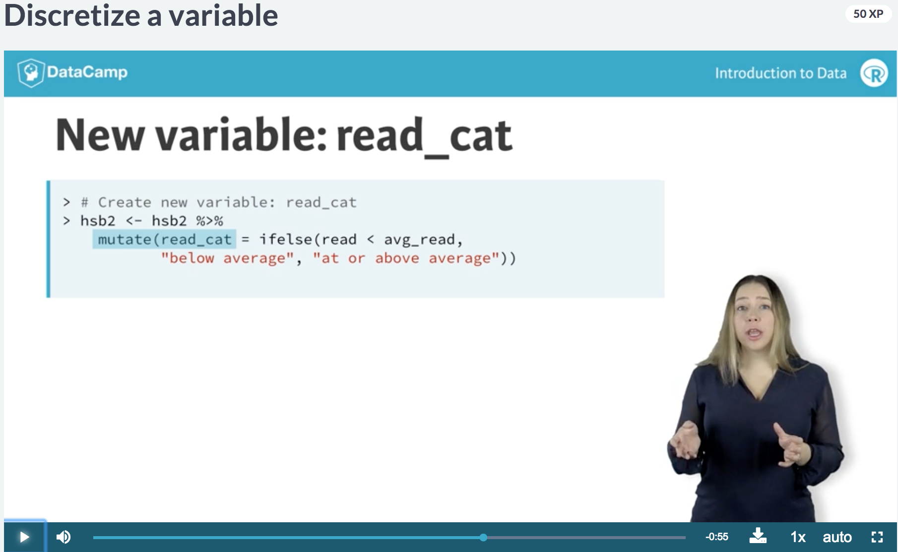
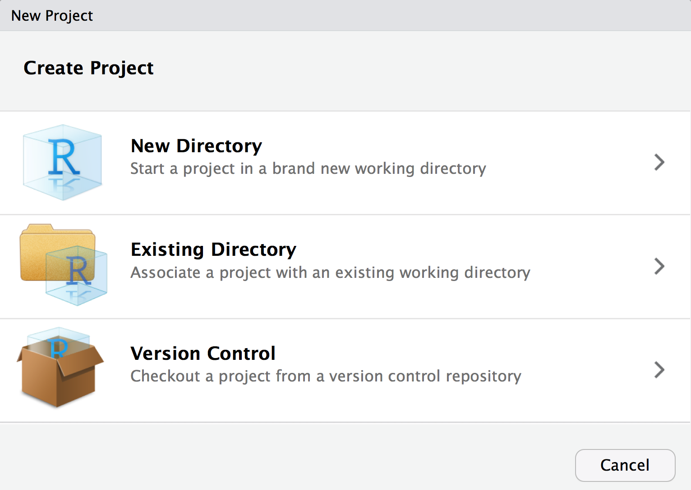

```{r set_this_up, include=FALSE}
options(htmltools.dir.version = FALSE)
options(knitr.table.format = "html") 
knitr::opts_chunk$set(warning = FALSE, message = FALSE, 
  comment = NA, dpi = 300,
  fig.align = "center", out.width = "65%", cache = FALSE,
  error = FALSE)
library(tidyverse)
library(reprohealth)
```


---
class: center, middle, inverse
## Everyone do this right now...


> *"Daily work habit: Restart R very often and re-run your under-development script from the top." -[Jenny Bryan](https://www.tidyverse.org/articles/2017/12/workflow-vs-script/)*

Upper right pane: click on environment tab, then click on the broom

Lower left pane: in console tab, click on the broom too 


---
## Back to the `wb_reprohealth` data

```{r}
library(tidyverse) # you'll need this too
library(janitor) # you'll need this too
library(reprohealth) # load the package
data(wb_reprohealth) # load the data
wb_stats <- wb_reprohealth # save the data to your local environment
```


---
class: inverse, middle, center

```{r echo = FALSE}
knitr::include_graphics("images/r-data-types.png")
```


## RStudio Base R Cheatsheet

https://github.com/rstudio/cheatsheets/blob/master/base-r.pdf


---

## Know your data types


* Numeric (2 subtypes)
    - Integers (`1, 50`)
    - Double (`1.5, 50.25`, `?double`)
* Character (`"hello"`)
* Factor (`grade = "A" | grade = "B"`)
* Logical (`TRUE | FALSE`)

--

```{r}
typeof(wb_stats$tot_fertility)
typeof(wb_stats$continent)
typeof(wb_stats$continent == "Oceania")
```

---
# Even better: `glimpse`

```{r}
glimpse(wb_stats)
```


---
# `wb_stats`

```{r echo = FALSE, out.width = '50%'}
head(wb_stats) %>% knitr::kable(format = "html")
```


---
# Data types

```{r echo = FALSE}
knitr::include_graphics("http://r4ds.had.co.nz/diagrams/data-structures-overview.png")
```


---
## Introduction to Data

You learned about using `table` the $ sign way...


```{r}
table(wb_stats$continent)
```

--

But the base R function for counting, `table()`, leaves much to be desired:

- It doesn’t accept data.frame inputs (and thus doesn’t play nicely with the `%>%` pipe)
- It doesn’t output data.frames
- Its results are hard to format. Compare the look and formatting choices of an R table to a Microsoft Excel PivotTable or even the table formatting provided by SPSS.

https://github.com/sfirke/janitor/blob/master/vignettes/tabyls.md

--

There is a better (tidy) way!


---
## Count

.pull-left[
```{r}
wb_stats %>% 
  count(continent) 
```
]

--

.pull-right[

```{r}
wb_stats %>% 
  filter(year == 2015) %>% 
  count(continent) 
```

]

---
## Doing more with `count`

```{r}
wb_stats %>% 
  filter(year == 2015) %>% 
  count(continent) %>% 
  add_tally() %>% # adds total countries
  mutate(perc_countries = n/sum(n) * 100) 
```

---
## Count by 2

```{r}
wb_stats %>% 
  count(continent, country) 
```

--

What is the `n` column counting?

--

💡 years of data per country/continent

---
## Double count


```{r}
wb_stats %>% 
  count(continent, country) %>% 
  count(continent)
```

--

What is the the `nn` column counting?

--

💡 Number of countries per continent (regardless of year- I didn't have to `filter` first!)

---
## 2-way frequency tables

Using the `janitor` package

.pull-left[

```{r}
wb_tab <- wb_stats %>% 
  filter(year == 2015) %>% 
  tabyl(continent)
wb_tab
```
]

--

.pull-right[

```{r}
wb_tab %>% 
  adorn_totals("row") %>%
  adorn_pct_formatting(digits = 1)
```

]

---
## Formatting frequency tables

Even better: use `knitr::kable()`

```{r}
wb_tab %>% 
  adorn_totals("row") %>%
  adorn_pct_formatting(digits = 1) %>% 
  knitr::kable(format = 'html')
```

---
## Discretize a variable

In the course, they made a new variable: below vs at or above average.

--

Quiz! How was this done in the DataCamp slides?


---
## Below vs. at/above average


---
## Below vs. at/above average

Answer- `mutate` with `ifelse` in slides. She also saved the mean as an external variable to do this- we don't have to do this extra step though!

--

Let's do this with `tot_fertility`

```{r}
wb_stats <- wb_stats %>% 
  mutate(fert_cat = ifelse(tot_fertility < mean(tot_fertility, 
                                                na.rm = TRUE),
                           "below average", "at or above average"))
```

--

Now how do we see this new discrete variable?

---
## Count our new discrete variable

--

```{r}
wb_stats %>% 
  count(fert_cat)
```


---
## How would you calculate this by year?

--

Hint: do a `group_by(year)` first, then use the exact same code

--

```{r}
wb_stats <- wb_stats %>% 
  group_by(year) %>% 
  mutate(fertbyyear_cat = ifelse(tot_fertility < mean(tot_fertility, 
                                                      na.rm = TRUE),
                           "below average", "at or above average"))
```

---
## Below vs. at/above average for each year

A little hard to read...

```{r}
wb_stats %>% 
  count(fertbyyear_cat)
```

---
## Below vs. at/above average for each year

`tidyr::spread` can help! 

```{r}
wb_stats %>% 
  count(fertbyyear_cat) %>% 
  spread(fertbyyear_cat, n)
```

---
## Visualize counts

```{r out.width = "50%"}
ggplot(wb_stats, aes(x = year, fill = fertbyyear_cat)) +
  geom_bar(position = "dodge") 
```

---
## Visualize proportions

```{r out.width = "50%"}
ggplot(wb_stats, aes(x = year, fill = fertbyyear_cat)) +
  geom_bar(position = "fill") 
```

---
## Visualize proportions with facetting

```{r fig.width = 15, fig.height = 10}
ggplot(wb_stats, aes(x = year, fill = fertbyyear_cat)) +
  geom_bar(position = "fill") +
  facet_wrap(~continent)
```

---
## Workflows

In the last class, we:

- Used R Markdown
- Learned how to use `knitr::render` (and that you can `render` the same .Rmd to multiple output formats)
- Learned to knit to html as an output format (the main one we focused on)
- Learned about `knitr` chunk options
  - Also having a `setup` chunk (setting a `fig.path`!)
- Learned about markdown formatting for plain text
- Learned how to customize the html output with
  - `toc` (`toc_float`, `toc_depth`)
  - `theme`
  - `highlight`
  
  
---
class: middle, inverse, center
## R Projects

Now...and for eternity (at least until the last day of this class)


---
## R Projects: how?


---
## R Projects: to do list

--

* Create an RStudio project for each data analysis project.

--

* Keep data files there, in a folder for example called `data`

--

* Keep scripts there; edit them, run them in bits or as a whole.

--

* Save your outputs (plots and cleaned data) there.

--

* Only ever use relative paths, not absolute paths.


---
class:middle, inverse, center
## Relative file paths

Now...and for eternity (at least until the last day of this class)


Use the `here` package when reading in a local data file, with the `here` function: `here::here`

https://github.com/jennybc/here_here

---
## Updated No-No List

.pull-left[


]

.pull-right[

- `attach` (NEVER)

- `setwd` (NEVER)

- dollar sign notation `wb_stats$year` (for now, some stats stuff will require it)

]

---
## Updated "Do Do" list


* `.Rproj` (http://r4ds.had.co.nz/workflow-projects.html)

* `here::here` for file paths (https://github.com/jennybc/here_here)

* Use R Markdown to combine code and text for reproducible analysis documents.
  - For text, use [Markdown formatting](https://www.markdowntutorial.com)
  - For code, use `knitr` [code chunk options](https://yihui.name/knitr/options/#chunk-options).


---
## To-Do List:

Here is the [lab assignment](../cm015.html)

We are expecting that the quality/aesthetics of your knitted html documents will be looking pretty professional at this point. This means:
- All packages needed loaded at the top of your document
- No package installations called/executed in your Rmd
- No warnings/messages printed when you load packages
- All chunks should be `echo = TRUE, eval = TRUE` (the default- so don't override these!)
- Use of markdown formatting to make your doc easier to follow (and thus to grade!)
- Relative file paths only using the `here` package (i.e., no `attach` or `setwd` in your scripts)
- No chunks with errors!
- *NEVER EVER* printing out an entire dataset to screen (> 10 rows). This kills trees and is never necessary.
- **We are looking for a high text-to-code ratio!!**
- Logistics: submitted a knitted html as requested, on time
  
  
---
## Grading

- DataCamp: 40% of your final grade
  - There are 42 chapters total
  - Completing 34 on time is a B- (32 pts)
  - Completing 38 on time is an A- (36 pts)
  - Completing all 42 on time is an A+ (40 pts)
- Labs: 30% of your final grade
  - Started in-class, turned in on Sakai by next class time
  - There will be about 18 labs total
  - You can drop your lowest 3 labs (= 1.5 weeks of class)
  - The 15 graded labs will each be graded check minus, check, check plus
  - If you get checks on all 15, that is roughly a B (25 pts)
    - Check plus on 1-2 labs --> A- (27 pts)
    - Check plus on 3-4 --> A (28 pts)
    - Check plus on 5+ --> A+ (30 pts)
    - Each check minus will be offset by a check plus (and vice versa)
- Integrative Labs: 20% of your final grade
  - There will be 4: July 12, August 2, August 23, September 6
  - Each will be worth 5% of your final grade

