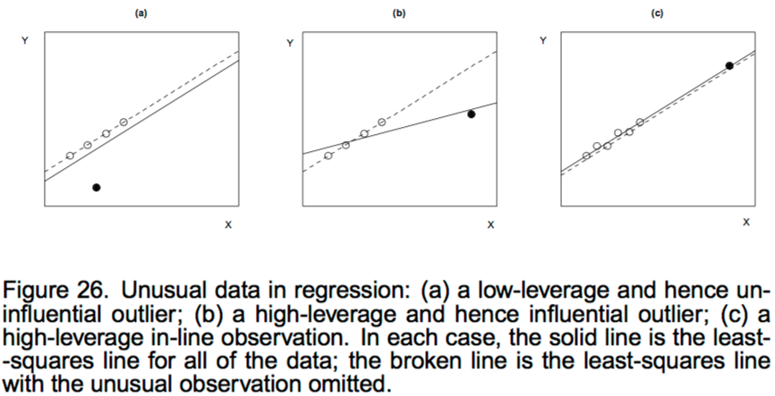
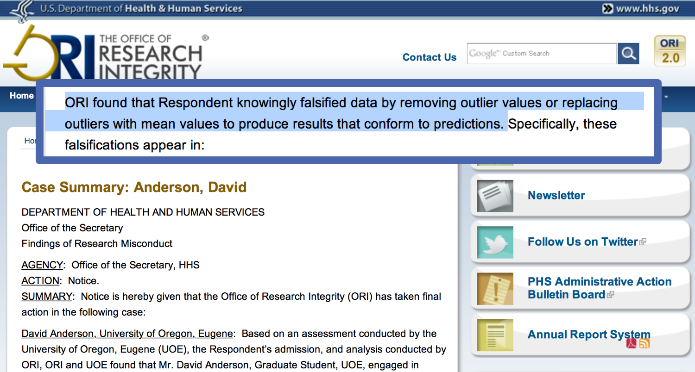

```{r setup, include=FALSE}
# leave this chunk alone
options(knitr.table.format = "html") 
knitr::opts_chunk$set(warning = FALSE, message = FALSE, 
  comment = NA, dpi = 300, out.width = '60%')
```

```{r packages, echo=FALSE, message=FALSE, warning=FALSE}
library(tidyverse)
library(moderndive)
library(extrafont)
library(broom)
library(GGally) 
library(skimr)
library(fivethirtyeight) 
library(ggfortify)
```


## Packages

```{r load_packages, eval = FALSE}
library(fivethirtyeight) 
library(moderndive)
library(skimr)
library(tidyverse)
library(GGally) 
library(broom)
```

---
## Data

```{r}
glimpse(hate_crimes)
```


---
## Pre-processing

```{r}
hate_demo <- hate_crimes %>% 
  select(state, avg_hatecrimes_per_100k_fbi, share_pop_hs, gini_index, 
         share_vote_trump) %>%  
  mutate(
    cat_trump = case_when(
      share_vote_trump < .5 ~ "less than half", 
      TRUE ~ "more than half"
      )) %>% 
  mutate(cat_trump = as.factor(cat_trump)) %>% 
  select(-share_vote_trump)
```

---
class: middle, center, inverse

## Your turn

As groups, discuss your model output: 

(1) look at the regression table, and 

(2) attempt to interpret the three values that define the regression plane

`r emo::ji("alarm")`

---
## Model 1: Two numerical predictors

```{r}
hate_two <- lm(avg_hatecrimes_per_100k_fbi ~ 
                   gini_index + 
                   share_pop_hs,
                 data = hate_demo)

get_regression_table(hate_two)
```


---
## Model 1: Two numerical predictors

$$\widehat{\textrm{avg_crimes}} = -54 + 64.3~ \textrm{gini_index} + 31.3~\textrm{share_pop_hs}$$


```{r echo = FALSE}
knitr::include_graphics("images/lm-whiteboard-process.jpg")
```

---
## Model 2: Parallel slopes

```{r}
hate_para <- lm(avg_hatecrimes_per_100k_fbi ~ 
                   gini_index + 
                   cat_trump,
                 data = hate_demo)

get_regression_table(hate_para)
```

```{r include = FALSE}
para_pts <- get_regression_points(hate_para)
para_pts %>% 
  summarize(var_resid = var(residual),
            se_resid = sd(residual))
```

```{r include = FALSE}
hate_minus <- lm(avg_hatecrimes_per_100k_fbi ~ 
                   gini_index + 
                   cat_trump,
                 data = filter(hate_demo, !state == "District of Columbia"))
#get_regression_table(hate_minus)
minus_pts <- get_regression_points(hate_minus)
minus_pts %>% 
  summarize(var_resid = var(residual),
            se_resid = sd(residual))
```

---
## Model 2: Parallel slopes

$$\widehat{\textrm{avg_crimes}} = -12.1 + 32.5~ \textrm{gini_index} + -.51~\textrm{cat_trump}$$


```{r echo = FALSE}
knitr::include_graphics("images/lm-whiteboard-process.jpg")
```


---
## Model 2: Parallel slopes

```{r echo = FALSE}
coeff <- lm(avg_hatecrimes_per_100k_fbi ~ 
                   gini_index + 
                   cat_trump,
                 data = hate_demo) %>% 
  coef() %>%
  as.numeric()
slopes <- hate_demo %>%
  group_by(cat_trump) %>%
  summarise(min = min(gini_index), 
            max = max(gini_index)) %>%
  mutate(intercept = coeff[1]) %>%
  mutate(intercept = ifelse(cat_trump == "less than half", intercept + coeff[3], intercept)) %>%
  gather(point, gini_index, -c(cat_trump, intercept)) %>%
  mutate(y_hat = intercept + gini_index * coeff[2])

ggplot(hate_demo, aes(x = gini_index, y = avg_hatecrimes_per_100k_fbi, col = cat_trump)) +
  geom_jitter() +
  labs(x = "gini index", y = "hate crimes", color = "trump") +
  geom_line(data = slopes, aes(y = y_hat), size = 1) +
  theme_minimal()
```

---
## Model 3: Interaction model

$$\widehat{\textrm{avg_crimes}} = -20.4 + 50.6~ \textrm{gini_index} + 25.7~\textrm{cat_trump} -57.9~\textrm{gini*cat_trump}$$
```{r echo = FALSE}
knitr::include_graphics("images/lm-whiteboard-3models.jpg")
```

---
## Model 3: Interaction model

$$\widehat{\textrm{avg_crimes}_{trump=1}} = 5.3 - 7.3~ \textrm{gini_index}$$

$$\widehat{\textrm{avg_crimes}_{trump=0}} = -20.4 + 50.6~ \textrm{gini_index}$$

```{r echo = FALSE}
knitr::include_graphics("images/lm-whiteboard-3models.jpg")
```

---
## Model 3: Interaction model

```{r}
hate_int <- lm(avg_hatecrimes_per_100k_fbi ~ 
                   gini_index* 
                   cat_trump,
                 data = hate_demo)

get_regression_table(hate_int)
```

---
## Visualize interaction model


```{r echo = FALSE}
ggplot(hate_demo, aes(x = gini_index, 
                      y = avg_hatecrimes_per_100k_fbi,
                      color = cat_trump)) +
  geom_point() +
  geom_smooth(method = "lm", se = FALSE) +
  facet_wrap(~cat_trump) +
  theme_minimal() +
  guides(color=FALSE)
```


---
## Model 3: Center predictors

Would this be easier to interpret after centering the predictor `gini_index`?

$$\widehat{\textrm{avg_crimes}_{trump=1}} = 2.54 - 7.3~ \textrm{gini_index}$$

$$\widehat{\textrm{avg_crimes}_{trump=0}} = 1.98 + 50.6~ \textrm{gini_index}$$

```{r echo = FALSE}
hate_int <- lm(avg_hatecrimes_per_100k_fbi ~ 
                   I(gini_index - mean(gini_index))* 
                   cat_trump,
                 data = hate_demo)

get_regression_table(hate_int)
```


---
## Model 3: Center predictors

```{r echo = FALSE}
ggplot(hate_demo, aes(x = (gini_index - mean(gini_index)), 
                      y = avg_hatecrimes_per_100k_fbi,
                      color = cat_trump)) +
  geom_point() +
  geom_smooth(method = "lm", se = FALSE) +
  facet_wrap(~cat_trump) +
  theme_minimal() +
  guides(color=FALSE)
```

---
## Model 4: Continuous interaction

```{r}
hate_cont <- lm(avg_hatecrimes_per_100k_fbi ~ 
                   gini_index * 
                   cat_trump,
                 data = hate_demo)

get_regression_table(hate_cont)
```


---
class: middle, inverse, center


---
## Definitions

> "Unusual data are problematic in linear models fit by least squares because they can unduly influence the results of the analysis, and because their presence may be a signal that the model fails to capture important characteristics of the data."

* An **outlier** is an observation whose response-variable value is conditionally unusual given the values of the explanatory variables.
* In contrast, a **univariate outlier** is a value of $y$ or $x$ that is unconditionally unusual; such a value may or may not be a regression outlier.

from [John Fox](https://socialsciences.mcmaster.ca/jfox/Courses/Brazil-2009/slides-handout.pdf)

---


---
## Types of influence


* Extremity on the x’s (leverage)
* Extremity on y (discrepancy)
* Influence on the regression estimates 
    * Global
    * Specific coefficients
    
---
## Start with one model

I'll choose the parallel slopes model

```{r}
hate_mod <- lm(avg_hatecrimes_per_100k_fbi ~ 
                   gini_index + 
                   cat_trump,
                 data = hate_demo)

get_regression_table(hate_mod)
```

---
## Diagnostic data frame

Use `data` argument to merge original data with diagnostics!
From [https://github.com/tidymodels/broom/issues/91](https://github.com/tidymodels/broom/issues/91)

```{r}
hate_mod <- lm(avg_hatecrimes_per_100k_fbi ~ 
                   gini_index + cat_trump, data = hate_demo)

hate_diag <- augment(hate_mod, data = hate_demo) 

glimpse(hate_diag)
```

---
## Contaminated observation or special snowflake?

* A **contaminated observation** is one that has been damaged in some way. Some examples:
    * Error of execution of the research procedure.
    * Inaccurate measurement of the dependent measure. 
    * Data entry error.
    * Error in calculating a measure.
    * Non-attentive or distracted participants.
* The outlier may simply be an **extremely rare case**. For example, a college freshman might be 12 years old and have an 800
SAT in math. Such an individual is extremely rare, but data is valid.

---
class: middle, inverse, center


---
class: middle, inverse, center


---
## Extremity on the `x`: leverage

* Standardized measure of how far the observed value for each observation is from the mean value on the set of `x` values
* Observations with high leverage have the potential to be influential, especially if also extreme on `y`
* The response-variable values are not at all involved in calculating leverage.

---
## Leverage

* Measure of how unusual the `x` value of a point is, relative to the `x` observations as a whole; leverage describes how unusual an observation is in predictor(s) data.
* $1/n \leq h_i \leq 1$. 
* If $h_{i}$ is large then the $i$th observation has considerable impact on the fitted value

--

```{r}
hate_diag %>% 
  select(state, .hat) %>%
  arrange(desc(.hat))
```

---
## Leverage 

[Rules of thumb from John Fox](https://socialsciences.mcmaster.ca/jfox/Courses/Brazil-2009/slides-handout.pdf)

```{r}
k <- 2
mean_hat <- (k + 1)/nrow(hate_demo)
# "large" samples
hate_diag %>% 
  select(state, .hat) %>%
  filter(.hat > (2*mean_hat))
```

```{r}
# "small" samples
hate_diag %>% 
  select(state, .hat) %>%
  filter(.hat > (3*mean_hat))
```

---
## Plot leverage against `x`

```{r out.width= '70%', echo = FALSE}
ggplot(hate_diag, aes(x = gini_index, y = .hat)) +
  geom_point() +
  geom_line(aes(y = 2*mean_hat), colour = "red", lty = "dashed") +
  geom_line(aes(y = 3*mean_hat), colour = "slateblue", lty = "dashed") +
  geom_text(aes(label = state), size = 2, vjust = 2) +
  theme_minimal()
```

---
## Plot leverage against `x`

```{r out.width= '70%', echo = FALSE}
ggplot(hate_diag, aes(x = gini_index, y = .hat)) +
  geom_point() +
  geom_line(aes(y = 2*mean_hat), colour = "red", lty = "dashed") +
  geom_line(aes(y = 3*mean_hat), colour = "slateblue", lty = "dashed") +
  geom_text(aes(label = state), size = 2, vjust = 2) +
  theme_minimal() +
  facet_wrap(~cat_trump)
```

---
class: middle, inverse, center
## Your turn

With your model, use `broom::augment()` to find observations with high leverage 


---
## Extremity on `y`: discrepancy

* The discrepancy (or $distance^2$) between each predicted and observed value of yi
* A studentized residual is an observed residual divided by its standard error; two types:
    * Internally studentized (`rstandard`): re-normalize the residuals to have unit variance, using a measure of the error variance.
    * Also `broom::.std.resid`
* Externally studentized (`rstudent`): re-normalize the residuals to have unit variance, using a leave-one-out measure of the error variance. This is a measure of the size of the residual, standardized by the estimated standard deviation of residuals based on all the data but that observation. Sometimes called jackknifed residuals.

---
## Internally studentized residuals

.pull-left[
```{r}
hate_diag %>% 
  select(state, .std.resid) %>% 
  arrange(.std.resid) %>% 
  slice(1:5)
```
]

.pull-right[
```{r}
hate_diag %>% 
  select(state, .std.resid) %>% 
  arrange(desc(.std.resid)) %>% 
  slice(1:5)
```
]

---
## Externally studentized residuals

* `rstudent`
* Sadly, not available in `broom::augment`

```{r}
hate_diag <- hate_diag %>% 
  mutate(.ext.resid = rstudent(hate_mod)) # add 

hate_diag %>% 
  select(state, .std.resid, .ext.resid) %>% 
  arrange(desc(.ext.resid)) %>% 
  slice(1:5)
```

---
## Expect 5% are 2+

```{r}
hate_diag %>%
  filter(abs(.ext.resid) >= 2) %>%
  select(state, gini_index, .resid, .std.resid, .ext.resid)
```

2 out of 51 are high:
3.9% of observations with ESR considered to be relatively large
(expected ≈ 2 or 3 observations)

---
class: middle, inverse, center
## Your turn

With your model, find observations with high externally studentized residuals (and thus high discrepancy), and compare to the raw residual value, and the internally studentized residual value. What do you notice?

---
class: middle, inverse, center
## Your turn 

A common heuristic: 

Influence on Coefficients = Leverage × Discrepancy

Do you have any observations with both high leverage and high discrepancy?

